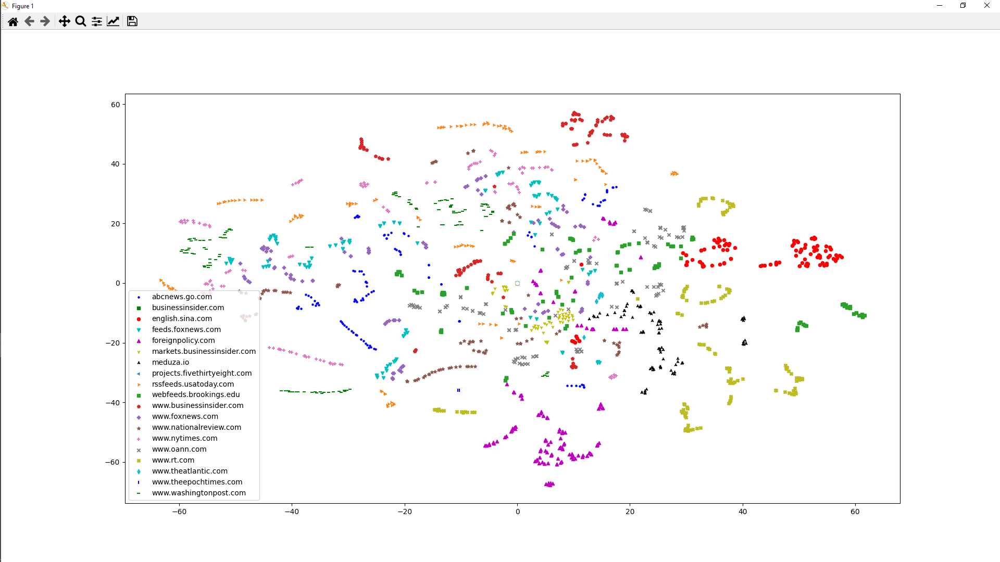
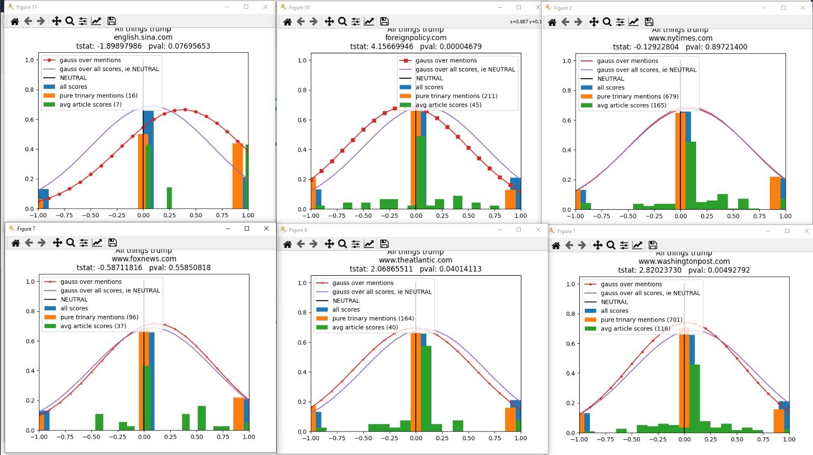
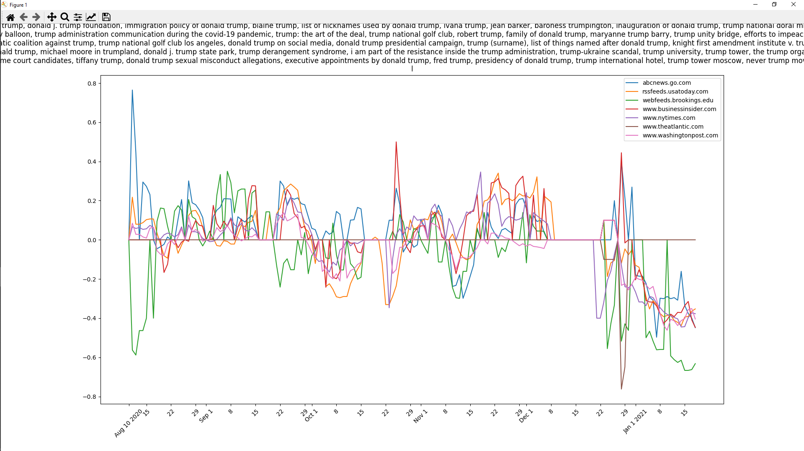

JSVNEWS
=======

Hello World
===========
prepping for pip
----------------
Download git \
`python -m pip install -e ./path/to/jsvnews`\
Dataset comes separately, I'll email you or something

my todo's
---------
1) Create statistical tests for detecting narrative shifts (ie an event occurred or editorial shift)
2) Create tests for comparing narrative similarity between different newspapers (allowing us to confirm similarly positioned newspapers, ie, WashPost resembles NYT more than foxnews or oann)
3) Create new dataset for updated model. The sentiment model so far assigns every named entity in a sentence an independent and one dimensional [neg, neu, pos] rating.
I would prefer a dataset made by mechanical turk for a two dimensional sentiment rating -> dimension one is "Are things going bad/neu/well for named entity", and dimension two 
is "Does named entity deserve our scorn, neutral, sympathy from this info."  This would mean we could analyze sentences such as "Evil Germany invades and occupies our allies the French."
as Germany -> [scorn, doing well] and France as [sympathy, doing bad].
4) User studies. How does our system correlate with what humans believe? a) Make app which pings our system to process news articles, then appends analysis on the end and asks for their agreement (Do you agree this article made Germany look evil?)

the pipeline
------------
1) scrape all articles from `utilities/rssfeeds.txt` 
2) clean html off with readability-lxml library
3) use spacy to detect named entities
4) combine similar named entities within article (Trump -> Donald Trump)
5) lookup named entity to find fully disambiguated name (Donald Trump -> Donald J. Trump), using a local cache of previous named entities, or wikipedia ping on cache miss
6) save article with disambiguated named entities in sqlite db
7) Split articles by sentences, cover up named entities with BERT [MASK] token. 
8) Run articles through BERT model, every [MASK] token receives a sentiment score.
9) Save a matrix for every publisher on that day's topic-sentiment counts

other scripts
-------------
run \
`import jsvnews.src.viz_biz.sentchart_topic as sct` \
`sct.run("Trump")` \
to view a matplotlib graph of sentiments related to Trump over the past 6 months. \
Sorry not sorry about bad namings.

pretty pictures
---------------
Clustering of newspapers \
 \
Comparing sentiments of Trump \
 \
Net sentiment scores of Trump over the past 6 months (each point avg over past week scores) \

Repo Architecture 
=================

- **utilities**: 
- **jsvnews**: 

Software Architecture
=====================

Describe the tools utilized. 

Genesis
=======

Why it was created

- Lead Developer [Julian Vaneck]()

* * * * *